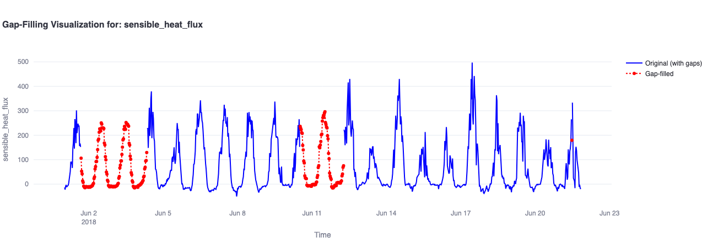

# Eddy Covariance Gap-Filling System 🌱


---

### 🚀 An interactive platform for processing, filling, and evaluating gaps in any time series - including flux tower datasets, using Machine Learning.

This app provides an end-to-end solution for working with **time serie data**, including:

✅ Uploading and preprocessing diverse enviromental and enery time series and raw flux tower data such as FLUXNET, AmeriFlux, and ICOS.
✅ Training gap-filling models using advanced ML techniques (XGBoost, Random Forest).  
✅ Visualizing filled vs. original data interactively. 
✅ Evaluating model performance (MAE, RMSE, R²).
✅ Advanced flux visualization.



---

### 🌍 Supported Datasets

| Dataset    | Description                                                                                           |
|------------|------------------------------------------------------------------------------------------------------|
| [FLUXNET](https://fluxnet.org/)   | Global network of micrometeorological tower sites measuring ecosystem fluxes.                    |
| [AmeriFlux](https://ameriflux.lbl.gov/) | North and South American flux data on ecosystem–atmosphere exchanges.                         |
| [ICOS](https://www.icos-cp.eu/)         | Integrated Carbon Observation System: harmonized GHG flux data across Europe.                   |
| Diverse Enviromental and Energy Data    | Meteorological, climate reanalysis, remote sensing, hidrology, energey generatation and etc.    |

---

### 🔧 Features

- Modular machine learning architecture with fallback models
- Deployable via [Streamlit Cloud](https://streamlit.io/cloud)

---

### 🌐 Live App

👉 **Try it here:** [eddy-gap-filling.streamlit.app](https://eddy-gap-filling.streamlit.app/)

---

### 📦 Setup

```bash
git clone https://github.com/ByMaxAnjos/eddy-covariance-gap-filling-system.git
cd eddy-covariance-gap-filling-system
pip install -r requirements.txt
streamlit run app/eddy_app.py